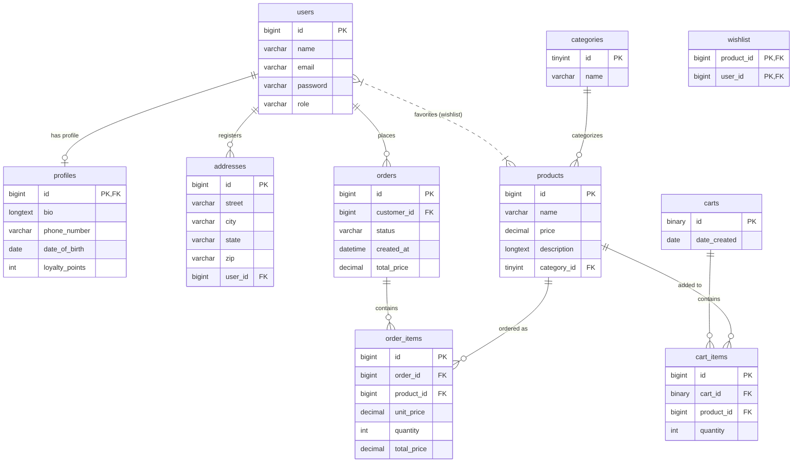
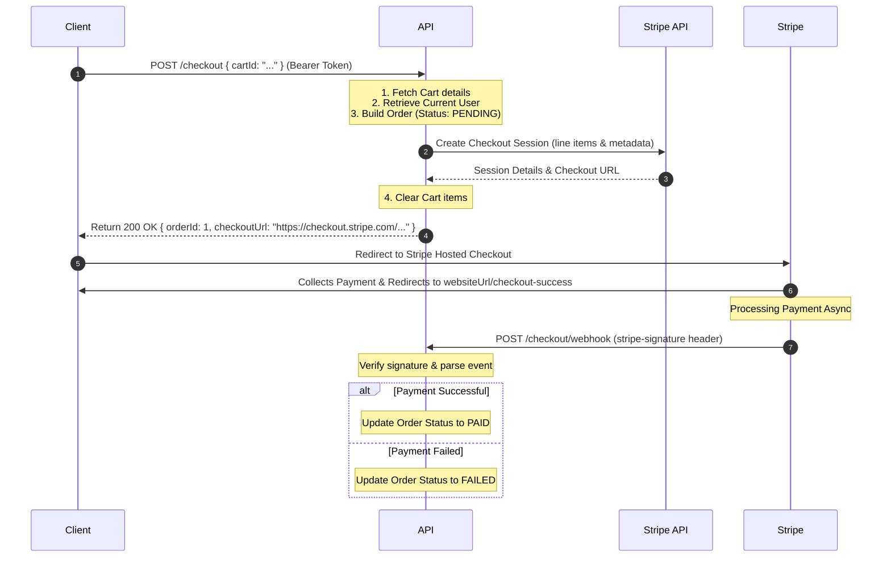

# Store API - Modern E-Commerce Backend

A production-ready, secure, and modular RESTful API built with **Spring Boot 4** and **Java 25**. This project serves as a showcase of modern software engineering practices, utilizing stateless JWT-based authentication, a clean decoupled payment flow with Stripe, relational database schema migrations, and structured component-oriented architecture.

Designed with a clear separation of concerns, this API provides robust back-end support for user management, product catalogs, shopping carts, checkout, orders, and payment integrations.

---

## Technical Stack & Architecture

- **Language Runtime:** Java 25 (utilizing modern syntax and standard APIs)
- **Framework:** Spring Boot 4.0.1 (Web, Security, Data JPA, Validation, Thymeleaf)
- **Database:** MySQL 8.x
- **Schema Migration:** Flyway Database Migration
- **Security:** Spring Security 6 with stateless JWT authentication (sliding session support)
- **Object Mapping:** MapStruct 1.6.3 (efficient Entity-to-DTO conversion)
- **Payment Processing:** Stripe Java SDK 31.1.0
- **Configuration Management:** Dotenv Java (loads `.env` parameters into JVM system properties)

### Architectural Flow

The project is structured around a decoupled layered architecture:

```
[ Client ] 
    │ (HTTP / JSON / Cookies)
    ▼
[ Security Filter Chain ] ◄── [ JwtAuthenticationFilter ]
    │ (Authorized Requests)
    ▼
[ Controllers ] ◄──► [ Mappers (MapStruct) ] ◄──► [ DTOs ]
    │
    ▼
[ Services / Interfaces ] ◄──► [ Gateways (Stripe SDK) ]
    │
    ▼
[ Repositories (Spring Data JPA) ]
    │
    ▼
[ Database (MySQL) ]
```

---

## Database Design & Entity Relationships

The relational database schema is managed via incremental **Flyway** migrations located under `src/main/resources/db/migration`. 

### Entity-Relationship Diagram (ERD)



---

## Modular Security Design

Instead of having a monolithic config block, this project configures Spring Security through a modular, decoupled structure using a custom interface:

```java
public interface SecurityRules {
    void configure(AuthorizeHttpRequestsConfigurer<HttpSecurity>.AuthorizationManagerRequestMatcherRegistry registry);
}
```

Any class implementing `SecurityRules` and annotated with `@Component` is injected into the primary security filter chain automatically:

- **`AuthSecurityRules`**: Exposes `/auth/login` and `/auth/refresh` endpoint routes.
- **`UserSecurityRules`**: Exposes user registration (`POST /users`) to the public.
- **`ProductSecurityRules`**: Regulates public read-access and restricted write-access to the product catalog.
- **`AdminSecurityRules`**: Restricts the `/admin/**` endpoints to users with the `ADMIN` role.
- **`SwaggerSecurityRules`**: Configures access to `/swagger-ui/**` and API documentation.

### Authentication Flow (Stateless JWT)

1. **Login**: User submits credentials to `/auth/login`. Upon success, the system returns a short-lived JSON Web Token (Access Token) in the response body.
2. **Sliding Sessions**: The system sets a long-lived **HttpOnly**, **Secure** cookie containing a `refreshToken` bound to `/auth/refresh`.
3. **Session Refresh**: When the access token expires, clients call `/auth/refresh` with the cookie to retrieve a new short-lived access token, bypassing password entry.

---

## API Endpoints

### 1. Authentication (`/auth`)

| Method | Endpoint | Description | Auth Required | Request Body / Cookies |
| :--- | :--- | :--- | :--- | :--- |
| `POST` | `/auth/login` | Log in and receive Access Token + Refresh Cookie | None | `{"email": "...", "password": "..."}` |
| `POST` | `/auth/refresh` | Get a new Access Token using Refresh Cookie | None (Requires Cookie) | Cookie: `refreshToken` |
| `GET` | `/auth/me` | Fetch currently authenticated user profile | Yes | Bearer Token |

### 2. User Management (`/users`)

| Method | Endpoint | Description | Auth Required | Request Body |
| :--- | :--- | :--- | :--- | :--- |
| `POST` | `/users` | Register a new user | None | `{"name": "...", "email": "...", "password": "..."}` |
| `GET` | `/users` | List all users (sorting optional: `?sortBy=email`) | Yes | None |
| `GET` | `/users/{id}` | Retrieve user by ID | Yes | None |
| `PUT` | `/users/{id}` | Update user fields (name, email) | Yes | `{"name": "...", "email": "..."}` |
| `DELETE` | `/users/{id}` | Remove a user | Yes | None |
| `POST` | `/users/{id}/change-password` | Change user password | Yes | `{"oldPassword": "...", "newPassword": "..."}` |

### 3. Product Catalog (`/products`)

| Method | Endpoint | Description | Auth Required | Request Body |
| :--- | :--- | :--- | :--- | :--- |
| `GET` | `/products` | List all products (filter optional: `?categoryId=1`) | None | None |
| `POST` | `/products` | Create a new product | Yes (Admin) | `{"name": "...", "description": "...", "price": 99.99, "categoryId": 1}` |
| `PUT` | `/products/{id}` | Update an existing product | Yes (Admin) | `{"name": "...", "description": "...", "price": 89.99, "categoryId": 1}` |
| `DELETE` | `/products/{id}` | Delete a product | Yes (Admin) | None |

### 4. Shopping Cart (`/carts`)

| Method | Endpoint | Description | Auth Required | Request Body / Params |
| :--- | :--- | :--- | :--- | :--- |
| `POST` | `/carts` | Initialize a new cart | None | None (Returns Cart UUID) |
| `GET` | `/carts/{cartId}` | Retrieve cart details and line items | None | None |
| `POST` | `/carts/{cartId}/items` | Add product to cart | None | `{"productId": 1}` |
| `POST` | `/carts/{cartId}/items/{productId}` | Update quantity of a product in cart | None | `{"quantity": 5}` |
| `DELETE` | `/carts/{cartId}/items/{productId}`| Remove item from cart | None | None |
| `DELETE` | `/carts/{cartId}/items` | Clear all items from cart | None | None |

### 5. Orders & Checkout (`/checkout` & `/orders`)

| Method | Endpoint | Description | Auth Required | Request Body |
| :--- | :--- | :--- | :--- | :--- |
| `POST` | `/checkout` | Initiate checkout for a cart (Returns Stripe Session URL) | Yes | `{"cartId": "UUID"}` |
| `POST` | `/checkout/webhook` | Stripe async events webhook endpoint | None | Stripe Webhook Payload |
| `GET` | `/orders` | Retrieve authenticated user's order history | Yes | None |
| `GET` | `/orders/{orderId}` | Fetch details of a specific order | Yes | None |

---

## Checkout & Payment Flow



---

## Configuration & Environment Variables

Create a file named `.env` in the root directory. Copy the structure below and input your specific credentials:

```ini
JWT_SECRET=your_jwt_signing_secret_min_32_characters
STRIPE_SECRET_KEY=sk_test_yourstripekeyhere
STRIPE_WEBHOOK_SECRET_KEY=whsec_yourwebhookkeyhere
```

### Database Profiles

- **Development (`dev`)**: Uses local configuration values under `src/main/resources/application-dev.yaml` targeting a local database called `store_api`.
- **Production (`prod`)**: Inherits configurations from `src/main/resources/application-prod.yaml` relying on runtime environment variables like `SPRING_DATASOURCE_URL`.

---

## Getting Started

### Prerequisites

- **Java Development Kit (JDK):** Version 25
- **Build Tool:** Apache Maven
- **Database Engine:** MySQL 8.x
- **Payment CLI (Optional for Webhooks):** Stripe CLI

### Setup Database

Log into your MySQL shell and create the database schema:

```sql
CREATE DATABASE store_api;
```

*(Note: Flyway will execute database migration scripts automatically on application startup to create tables, keys, and schemas)*

### Build and Run

1. Clone the project files:
   ```bash
   git clone <repository_url>
   cd spring-api
   ```
2. Set up the `.env` file containing configuration keys in the root.
3. Build the project artifacts:
   ```bash
   ./mvnw clean package
   ```
4. Start the Spring Boot application server:
   ```bash
   ./mvnw spring-boot:run
   ```

### Webhook Tunneling (Stripe testing)

To test Stripe Webhooks locally:

1. Log in to Stripe via the CLI:
   ```bash
   stripe login
   ```
2. Forward events to the local dev server webhook controller endpoint:
   ```bash
   stripe listen --forward-to localhost:8080/checkout/webhook
   ```
3. Copy the printed webhook signing secret (`whsec_...`) and update your `.env` value under `STRIPE_WEBHOOK_SECRET_KEY`.
