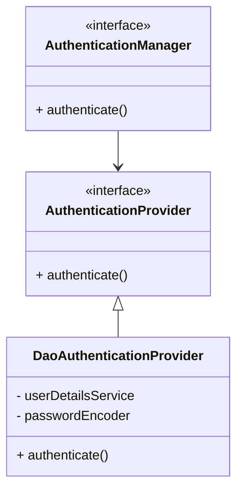

# Introduction to Spring MVC

---

### How the Web Works

When browsing a website, a **client** (the browser) sends a request to a **server**. The server processes this and
returns a **response**. This exchange is governed by **HTTP** (HyperText Transfer Protocol).

#### Anatomy of HTTP

| Part               | Description                                  |
|--------------------|----------------------------------------------|
| **Request Method** | Specifies the action (GET, POST, PUT, DELETE).|
| **Request URL** | The address of the specific resource being requested.|
| **Request Headers** | Extra metadata like content type or authentication tokens.|
| **Request Body** | Optional data sent to the server, such as form submissions.|
| **Response Status Code** | Indicates success or failure (e.g., 200 OK, 404 Not Found).|
| **Response Headers** | Metadata describing the returned response.|
| **Response Body** | The actual content, such as HTML markup or JSON data.|

---

### Web Page Generation

Web pages are built using **HTML** (HyperText Markup Language) through two primary methods:

* **Server-Side Rendering (SSR):** The server generates the full HTML page and sends it to the client.

* **Client-Side Rendering (CSR):** The server sends raw JSON data, and the client uses JavaScript to generate the page
dynamically.

#### Key Definitions

* **JSON (JavaScript Object Notation):** A lightweight, human-readable format used to structure data, commonly used in
APIs.

* **API (Application Programming Interface):** A communication bridge that allows clients to send or request data to and
from a server.


---

### The MVC Pattern

Spring MVC organizes applications into three distinct parts:

1. **Model:** Represents the data and business logic, often mapped to database entities.

2. **View:** Defines the data display, often using template engines like Thymeleaf in traditional apps.

3. **Controller:** The coordinator that handles HTTP requests, processes data, and returns responses.


---

### Handling Requests in Spring MVC

Spring MVC utilizes specialized annotations to manage different types of web traffic:

* **`@Controller`**: Primarily used for returning HTML views.

* **`@RestController`**: Used for returning data; it automatically converts Java objects into JSON.

#### Code Examples

**1. Returning an HTML View**

```java

@Controller
public class HomeController {
    @RequestMapping("/")
    public String index(Model model) {
        model.addAttribute("name", "Mosh");
        return "index"; // Returns index.html
    }
}

```

**2. Returning JSON Data**

```java

@RestController
public class MessageController {
    @RequestMapping("/hello")
    public Message sayHello() {
        return new Message("Hello World!"); // Converted to JSON
    }
}

```
# Building RESTful APIs

This guide details the design and implementation of RESTful APIs in Spring Boot, covering HTTP request handling, API response structuring, and the execution of CRUD operations.

---

### Creating APIs

Spring Boot uses specific annotations to define the structure of a REST controller:

* **`@RestController`**: Identifies a class as a controller for a REST API.


* **`@RequestMapping`**: Sets the base URL path for all endpoints defined within that controller.


```java
@RestController
@RequestMapping("/products")
public class ProductController { }

```

---

### Handling HTTP Requests

Different annotations allow you to extract data from various parts of an incoming HTTP request:

* **`@PathVariable`**: Used to extract values directly from the URL path, such as a specific resource ID.


```java
@GetMapping("/{id}")
public Product getProduct(@PathVariable Long id) {}

```


* **`@RequestParam`**: Extracts query parameters from the URL, which is a standard practice for filtering and sorting data.


* **`@RequestHeader`**: Reads specific HTTP headers, typically used for metadata or authentication tokens.


* **`@RequestBody`**: Extracts data from the body of the request, which is common when creating or updating resources.


---

### Handling HTTP Responses

To provide structured and meaningful feedback to the client, Spring Boot uses specific tools for response management:

* **`ResponseEntity`**: A utility class used to customize the entire API response, including the status code, headers, and body.


* **Common HTTP Status Codes**:
* **200 OK**: The request was successful.


* **201 Created**: A new resource was successfully created.


* **400 Bad Request**: The request was invalid.


* **404 Not Found**: The requested resource does not exist.


---

### Using DTOs and Mapping

To maintain a clean architecture and security, internal database entities should not be exposed directly to the client.

* **Data Transfer Objects (DTOs)**: Custom objects used to define exactly what data should be sent in an API response.


* **MapStruct**: A library that automates the conversion between database entities and DTOs, removing the need for manual mapping code.


```java
@Mapper(componentModel = "spring")
public interface ProductMapper {
    @Mapping(source = "category.id", target = "categoryId")
    ProductDto toDto(Product product);
}

```

---

### CRUD Operations

The following table summarizes how standard database actions map to HTTP methods in a RESTful service:

| Operation | HTTP Method | Description |
| --- | --- | --- |
| **Create** | `POST` | Adds new data to the database.|
| **Read** | `GET` | Retrieves data, often with filtering or sorting.|
| **Update** | `PUT`/`PATCH` | Modifies existing records.|
| **Delete** | `DELETE` | Removes data while handling errors.|
| **Action Update** | `POST` | Used for state changes that don't fit standard CRUD (e.g., password changes).|

---

# Validating API Requests

---

### Jakarta Validation Annotations

Spring Boot leverages Jakarta Validation to enforce rules directly on data fields using annotations.

#### String Validation

* **`@NotBlank`**: Ensures a string is not empty and contains at least one non-whitespace character.


* **`@NotEmpty`**: Ensures a string is not empty (`""`) but allows whitespace.


* **`@Size`**: Enforces specific character length constraints.


* **`@Pattern`**: Ensures the value matches a defined regex pattern (e.g., for phone numbers).


* **`@Email`**: Validates that the string follows a proper email format.


#### Number Validation

* **`@Positive` / `@PositiveOrZero`**: Ensures the value is greater than 0, or 0 and greater, respectively.


* **`@Negative` / `@NegativeOrZero`**: Ensures the value is less than 0, or 0 and less, respectively.


* **`@Min(value)` / `@Max(value)`**: Enforces a minimum or maximum numerical value.


#### Date and Time Validation

* **`@Past` / `@PastOrPresent`**: Ensures the date is in the past, or allows for today's date.


* **`@Future` / `@FutureOrPresent`**: Ensures the date is in the future, or allows for today's date.


#### General Validation

* **`@NotNull`**: Ensures the field value is not null.


---

### Handling Validation Errors

When a request fails validation, Spring throws a `MethodArgumentNotValidException`.

#### Local and Global Handling

* **Local Handling**: You can use `@ExceptionHandler` within a specific controller to catch errors and return structured messages.


* **Global Handling**: Using `@ControllerAdvice`, you can move error handling to a centralized class to maintain consistency across the entire application.


```java
@ExceptionHandler(MethodArgumentNotValidException.class)
public ResponseEntity<Map<String, String>> handleValidationErrors(MethodArgumentNotValidException exception) {
    var errors = new HashMap<String, String>();
    exception.getBindingResult().getFieldErrors().forEach(error -> 
        errors.put(error.getField(), error.getDefaultMessage()));
    return ResponseEntity.badRequest().body(errors);
}

```


# Custom Validation and Business Rules

Sometimes built-in annotations are insufficient for specific needs.

* **Custom Annotations**: You can create custom validation annotations by defining an `@interface` and a corresponding validator class.


* **Business Rules**: Validation that requires external checks (like querying a database to see if an email is already taken) is typically handled in the controller rather than through annotations.


* **Validation Order**: Input format is validated first via annotations; if those pass, business rules are then checked in the logic.


```java
if (userRepository.existsByEmail(request.getEmail())) {
    return ResponseEntity.badRequest().body(
        Map.of("email", "Email is already registered.")
    );
}

```


---

## JSON Web Tokens (JWT)

* A **JSON Web Token (JWT)** is a compact, URL-safe string used to securely transmit information about a user between a client and a server.
* It has **three parts**, separated by dots (`.`):

```
<Header>.<Payload>.<Signature>
```

### JWT Components

* **Header**

    * Specifies the signing algorithm and token type.

* **Payload**

    * Contains the actual data (called *claims*), such as user ID, email, role, etc.

* **Signature**

    * A cryptographic hash of the header and payload, signed with a secret key.
    * Ensures the token has not been tampered with.

---

## Token Types in JWT Authentication

### Access Token

* Used to access protected API endpoints.
* Sent by the client on **every request** to the server.
* Short-lived (usually **15 minutes or less**).
* If compromised, the short lifespan limits damage.
* Storage options:

    * **Memory** (safer, but cleared on page reload)
    * **localStorage** (persistent, but accessible to JavaScript)

---

### Refresh Token

* Used to obtain a new access token when the current one expires.
* Long-lived (typically **7 days or more**).
* Reduces the need for the user to log in repeatedly.
* Should be delivered as a **secure HttpOnly cookie** so it is not accessible from JavaScript.

---

# Securing APIs with Spring Security

## Authentication Fundamentals

We have two main authentication methods:

* **Session-based authentication**

    * Stores session data on the server.
    * Suitable for traditional web apps.
    * Not ideal for REST APIs.

* **Token-based authentication**

    * Uses stateless JWTs.
    * Better suited for REST APIs.

---

## User Login and Password Security

* Spring Security provides the `PasswordEncoder` interface for hashing passwords.
* Authentication flow:

    * Uses Spring’s built-in `AuthenticationManager`
    * Delegates authentication to an `AuthenticationProvider`

---

## Spring Security Authentication Flow (Diagram)



---


